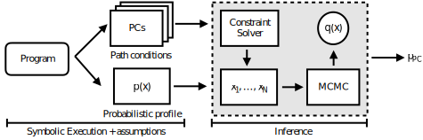

# SYMPAIS: Symbolic Parallel Adaptive Importance Sampling for Probabilistic Program Analysis
**[Overview](#overview)** | **[Installation](#installation)** |
**[Documentation](#documentation)** | **[Examples](#examples)** |
**[Notebooks](#notebooks)** | **[Paper](https://arxiv.org/abs/2010.05050)**

[](https://github.com/ethanluoyc/sympais/actions/workflows/ci.yaml)
[](./LICENSE)

<p align="center">
  
</p>

Python implementation of SYMPAIS introduced in the paper

> Yicheng Luo, Antonio Filieri, and Yuan Zhou. _Symbolic Parallel Adaptive Importance Sampling for Probabilistic Program Analysis._ To appear in Proceedings of the 29th ACM Joint Meeting on European Software Engineering Conference and Symposium on the Foundations of Software Engineering (ESEC/FSE 2021).
[arXiv:2010.05050](https://arxiv.org/abs/2010.05050).

Note: the arXiv version is currently outdated and will updated soon to include the material from the conference submission.
## Installation
### Requirements
The library is tested in the following environment.

- Linux (tested on Ubuntu 18.04)
- Python 3.8
- [RealPaver v0.4](http://pagesperso.lina.univ-nantes.fr/~granvilliers-l/realpaver/)
### Install RealPaver
Note that SYMPAIS uses RealPaver v0.4 for interval constraint solving.
We do not install RealPaver as part of `pip install -e .`
Please refer to the [RealPaver documentation](http://pagesperso.lina.univ-nantes.fr/~granvilliers-l/realpaver/src/realpaver-0.4.pdf) for how to install RealPaver v0.4 on Linux.
For our development, we use `third_party/RealPaver/build.sh` to install RealPaver v0.4 on Ubuntu,

To compile RealPaver from source, first run `apt-get` to install following system dependencies
```
sudo apt-get install flex bison libfl-dev libgmp-dev
```

Then run the following commands download realpaver-v0.4 source, compiles it and install it
(assuming the right permissions) on the local environment.

```bash
curl -O http://pagesperso.lina.univ-nantes.fr/~granvilliers-l/realpaver/src/realpaver-0.4.tar.gz
tar -xzvf realpaver-0.4.tar.gz
cd realpaver-0.4
make
make install
```

### Install Python packages

We do not provide PyPI installation so you have to install from source.
First clone the repository by running
```bash
git clone --recursive git@github.com:ethanluoyc/sympais.git
```
We use Poetry for managing dependencies. To set up the environment with Poetry, run
```
poetry install
```

Alternatively you can also create a virtual environment for this repository, e.g., by running
`python3 -m venv venv && source venv/bin/activate`.

Then install the project in development mode by running
```
pip install -U pip setuptools wheel # We require more recent versions of pip wheel and setuptools
pip install -e .
```
This installs both the the runtime dependencies and development dependencies.

### Install with Docker
We also provide a [Dockerfile](./Dockerfile) for creating a environment similar to the one
we used for producing the benchmark results. To reproduce an environment with Docker run
```bash
docker build -t sympais .
```

Please create an [issue](https://github.com/ethanluoyc/sympais/issues) if the installation fails.

## Examples
To run an example of probabilistic symbolic execution (PSE), refer to scripts
in `examples/`.

In particular,

- `run_sphere_3_dmc.py` will run the DMC baseline on sphere (d=3). You should get a final
estimated mean of around 0.058 by running the DMC baseline.
- `run_sphere_3_sympais.py` will run SYMPAIS on sphere (d=3), using the RMH kernel,
with the initialization scheme introduced in the paper. Running this should also give
you comparable results to the DMC baseline.

If you are using a Docker environment, you can run the example scripts above by
first starting an interpreter with
```
docker run -it --rm --entrypoint /bin/bash sympais
```
Then you can run the examples with
```
poetry run python examples/run_sphere_3_dmc.py
```
Notice the prefix `poetry run`. This ensures that you are using the correct Python virtual environment when running the scripts.
## Notebooks
In addition to the example scripts, we provide Jupyter notebooks for reproducing
the results in our paper as well as a tutorial notebook ([getting_started.ipynb](./notebooks/getting_started.ipynb)) which walks you through the
APIs for extending SYMPAIS. The notebooks handle installing SYMPAIS in Colab so that
you do not have to install the dependencies locally.
A full list of the notebooks and descriptions can be found in
[notebooks/README.md](notebooks/README.md).

## Reproducing results
To reproduce results reported in the figure, refer to the *.sh files in [scripts/](./scripts) to reproduce results for individual tasks.
The scripts call `src/sympais/experiments/run.py` with different sweeps of parameters to produce the results.
We use [Hydra](https://hydra.cc) to manage configurations and run sweeps.

The configuration is defined in [config.yaml](./src/sympais/experiments/conf/config.yaml).

```yaml
defaults:
    - hydra/launcher: joblib
    - method: pimais
    - task: sphere

seed: 0
num_samples: 1000000
disable_jit: false
```
You can override parts of the configuration by overriding the corresponding configuration group.
For example, to run SYMPAIS on torus with the correlated input profile, enabling tuning of the
RMH kernel, with seed 1 and for a total of 2e6 samples, run:

```bash
poetry run python src/sympais/experiments/run.py task=torus \
    task.profile_type=correlated \
    method=pimais \
    method.tune=true \
    num_samples=2_000_000 \
    seed=1
```
Refer to the Hydra [documentation](https://hydra.cc/docs/intro) for how to override configuration.

Running the entire benchmark requires a large amount of computing power. We use
a machine with 48 CPU cores (AMD EPYC 7401P) and memory of 441G to perform the benchmark sweeps.
We limit each job to use at most two cores.

Nevertheless, running a single instance of SYMPAIS should be reasonably performant.
We do not find actual sampling time to be a bottleneck for our SYMPAIS implementation thanks for JAX Just-in-Time compilation.
However, we currently have [known issues](#known-issues) scaling the problems
involving a large number of constraints as we found JAX to spend most of the time
compiling the large computation graph.

We include a Jupyter notebook `notebooks/results.ipynb`
for generating the figures from running the benchmark above. The results
may differ slightly from the original conference submission since we have made some
changes to the algorithm implementation.
The results were obtained by running Python 3.8.3 on Ubuntu 18.04.5 LTS (Bionic Beaver).
## Overview

<p align="center">
  
</p>

This library represents the the problem of probabilistic analysis in the framework
illustrated by the image above.

To perform probabilistic program analysis, we require the user to provide
1. A definition for the input probabilistic distribution (the profile).
In our implementation, this is represented by a class `Profile` similar to
`Distribution` classes in `numpyro` and `tensorflow_probability`.
This class implements functions that can sample inputs
to a probabilistic profile as well as evaluating the log pdf or cdf given concrete input values.
2. A list of path constraints that the user wants to obtain probabilistic quantification.
This is represented as a list of SymPy expressions.

In addition to the above two requirements, the user also needs to provide
the interval domain for the input distribution. When using a truncated distribution
this would be the upper and lower parameters.

We provide a SYMPAIS implementation by implementing the underlying MCMC sampler
and PI-MAIS with JAX. The inference algorithms are located in the directory
[src/sympais/infer/](./src/sympais/infer/).
We follow a similar design as [FunMC](https://arxiv.org/abs/2001.05035)
to achieve compositionality.
We batch the parallel chain sampling to efficiently scale to a
large number of parallel chains and use `jax.jit` to speed up the computation.
The samplers are separate from SYMPAIS and can be easily re-purposed for
other research areas.

We provide implementations of the SYMPAIS algorithm combining with the
RMH or HMC kernel, but we expect improvement in Bayesian inference algorithms
and symbolic execution methods to continue improving SYMPAIS's performance.

We also include baseline implementation of DMC and qCoral. However, please
refer to the official qCoral implementation if you are interested getting
results from the original implementation.

## Documentation
It's best to learn more about SYMPAIS by looking at the source.
The documentation can be found in subfolders' READMEs and inline as docstrings.
Check out the [src](./src) folder.
A good starting point is [src/sympais/algorithm.py](src/sympais/algorithm.py).
Please don't hesitate and use GitHub issues for asking questions if anything is unclear.

## Known limitations
Since this is a prototype implementation. There are some known limitations.

- We do not support discrete distributions. In theory, SYMPAIS is generic to support
arbitrary input distribution. However, since we only implemented the
RWMH kernel with a Gaussian proposal (or Hamiltonian Monte Carlo, which only supports continuous distributions),
we do not currently support discrete distribution.
In the future, generic transition kernels can be implemented (or by using
a mature MCMC library) to provide support for discrete distributions. Another technical
difficulty in handling discrete inputs comes from using the RealPaver constraint solver.
While RealPaver does support integer domains, it relies on continuous relaxation
(i.e., relaxing the integers to reals for finding the interval domains and then casting
back to reals), this is both efficient (and may be unsound).
- Does not support numpyro native distributions as inputs. The user
currently cannot use a `numpyro.Distribution` directly as the input probabilistic profile.
This is so that SYMPAIS integrates well with SymPy. Refer to (Getting started)[notebooks/getting_started.ipynb] notebook for more details. Furthermore, this also means native
correlated multivariate distribution (e.g., MulrivariateNormal) is not supported, although it is
easy to easily create adaptors for multivariate correlated distributions. Refer to the notebook
for examples.

## Known issues
You may notice that SYMPAIS's running time grows disproportionally for more complex
tasks (i.e., tasks that involve more constraints or higher-dimensional inputs.).
We found the increase in running time to be primarily due to growing JIT compilation time
(instead of sampling time). Evaluating the constraints involve a large number of
small ops to be created, which in the worst case causes the JIT compilation time to grow
[quadratically](https://github.com/google/jax/discussions/3478). If this becomes
a bottleneck, consider reusing the JIT-compiled functions if you want to reduce the JIT compilation overhead.
## Contributing
Thanks for your interests in contributing to SYMPAIS!
Please use the Github [issues](https://github.com/ethanluoyc/sympais/issues) for asking questions.
If you are interested in contributing new features, please first create an issue before submitting [PRs](https://github.com/ethanluoyc/sympais/pulls).
PRs should pass a set of checks for them to be merged.
We use
* poetry for managing dependencies,
* pytest for running tests,
* pylint for linting,
* yapf for formatting the code,
* isort for sorting the dependencies,
* and pytype for typechecking.

Refer to the `Makefile` for how to run these pipelines.

We follow the [Google Python Style Guide](https://google.github.io/styleguide/pyguide.html).
This means using two-spaces instead of four-spaces as prescribed by PEP8.

All contributions should be accompanied by unit tests.
You may find the `pre-commit` hooks useful for ensuring that your contributions conform to the styles used in this repo.

There is a list of things that we would love to receive contributions.
1. Support alternative distribution backends. We (for legacy reasons) used [NumPyro](https://github.com/pyro-ppl/numpyro)'s distribution
implementation to implement the input distribution. It would be nice if we can also
support other distributions such as those in [TensorFlow Probability](https://www.tensorflow.org/probability) [substrates](https://www.tensorflow.org/probability/api_docs/python/tfp/substrates) or [Distrax](https://github.com/deepmind/distrax). In particular, TensorFlow provides more native distribution implementations compared to NumPyro.
1. Supporting a mature inference library. We would love to integrate with a mature MCMC
such as those in numpyro, TensorFlow-Probability, PyMC3. Our current implementation
uses a customized implementation with simple interface for performing MCMC sampling which should be easy to integrate with a inference library.
2. Handling multivariate inputs as high-dimensional tensors. The multivariate inputs
are currently represented as a list of scalar inputs. This may creates unnecessarily large
computation graph in JAX, which slows down JIT compilation considerably.
It may be interesting to represent these natively with symbolic tensors instead of a list of scalars. This requires the constraint solver to support vector inputs natively.

## Citation
If you use this code for your research, please cite us as

```
@inproceedings{luo21sympais,
  author = {Yicheng Luo and Antonio Filieri and Yuan Zhou},
  title = {Symbolic Parallel Adaptive Importance Sampling for Probabilistic Program Analysis},
  year = {2021},
  publisher = {Association for Computing Machinery},
  booktitle = {Proceedings of the 29th ACM Joint Meeting on European Software Engineering Conference and Symposium on the Foundations of Software Engineering (ESEC/FSE)},
  location = {Athens, Greece},
  series = {ESEC-FSE '21}
}
```

## How to pronounce SYMPAIS

_sim-pai_. The name is inspired by _Senpai_, the Japanese word for master (先輩).
